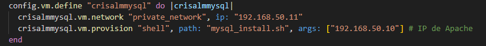
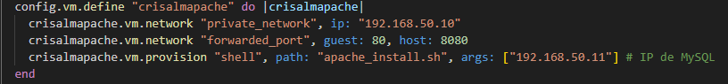
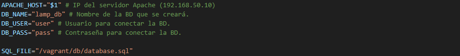
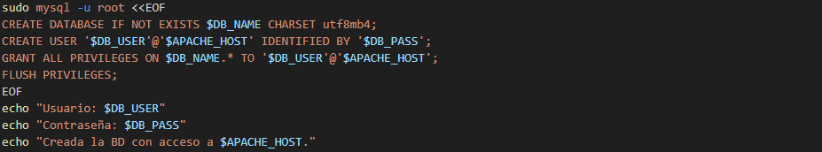
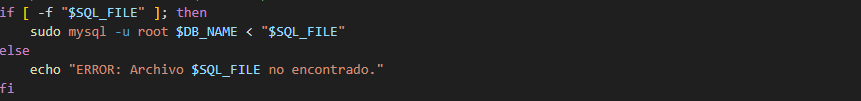

# Pila LAMP 2 Niveles: Aprovisionamiento con Vagrant
Infraestructura LAMP en dos máquinas virtuales (VMs), Apache y MySQL, aprovisionadas mediante scripts con Vagrant.

## Índice

* [1. Arquitectura](#1-arquitectura)
* [2. Requisitos Previos](#2-requisitos-previos)
* [3. Configuración del Vagrantfile](#3-configuración-del-vagrantfile)
  * [¿Qué es el Vagrantfile?](#qué-es-el-vagrantfile)
  * [Configuración](#configuración)
* [4. Script de Aprovisionamiento: Mysql](#4-script-de-aprovisionamiento-mysql)
  * [Declaración de Variables](#declaración-de-variables)
  * [Actualización e Instalación de MariaDB](#actualización-e-instalación-de-mariadb)
  * [Eliminación de la Puerta de Enlace NAT](#eliminación-de-la-puerta-de-enlace-nat)
  * [Modificación del `bind-address`](#modificación-del-bind-address)
  * [Creación de la base de datos](#creación-de-la-base-de-datos)
  * [Importación del archivo SQL](#importación-del-archivo-sql)
* [5. Script de Aprovisionamiento: Apache](#5-script-de-aprovisionamiento-apache)

---

## 1\. Arquitectura.

La implementación de la infraestructura distribuida en dos máquinas virtuales separa el servidor web de la base de datos, creando una capa de aislamiento esencial para la seguridad.

| Máquina | Función | IP |
| --- | --- | --- |
| **CrisAlmApache** | Servidor Web (Apache + PHP) | `192.168.50.10` |
| **CrisAlmMysql** | Servidor de Base de Datos (MariaDB) | `192.168.50.11` |
 
El **servidor web** debe disponer de dos adaptadores de red: la **NAT**, que viene por defecto, y una **red interna** privada. Podrá comunicarse con el exterior y con la base de datos. El **servidor de base de datos** usará solo la **red interna**, estando así protegido de conexiones externas. 

-----

## 2\. Requisitos Previos.

Se requiere tener instalados al menos los siguientes programas:

* **VirtualBox** (Software de virtualización). Descargar [aquí](https://www.virtualbox.org/wiki/Downloads).
* **Vagrant** (Herramienta para la creación y configuración de entornos de desarrollo virtualizados). Descargar [aquí](https://developer.hashicorp.com/vagrant/downloads).

La estructura de carpetas necesaria es la siguiente:

```bash
[Directorio]
├── Vagrantfile
├── mysql_install.sh
├── apache_install.sh
├── db/
│   └── database.sql  (El esquema de tablas)
└── src/
    └── index.php, config.php, etc. (El código de la aplicación)
```

Las carpetas db y src se pueden obtener de este mismo repositorio.

A continuación, se explicará cómo configurar el Vagrantfile y los dos scripts de aprovisionamiento.

-----

## 3\. Configuración del Vagrantfile.

### ¿Qué es el Vagrantfile?

El `Vagrantfile` es un archivo de configuración para el entorno virtualizado. Define los parámetros de las máquinas virtuales (VMs), como la imagen base (`box`), las direcciones IP, los puertos, las carpetas compartidas, y las instrucciones de aprovisionamiento.

### Configuración.

La configuración se basa en la imagen `debian/bookworm64` para ambas máquinas virtuales, asegurando la consistencia del entorno.

Con `config.vm.box` se indica la imagen del sistema operativo; en este caso, Debian (Debian 12).


Para ambas máquinas, es necesario definir los siguientes parámetros que establecen la estructura de la arquitectura:

* `config.vm.define`: Define el nombre que se usará para referirse a la VM en los comandos de Vagrant (por ejemplo: `vagrant up crisalmmysql`).
* `vm.network "private_network", ip: ...`: Asigna una IP estática en una red privada.
* `vm.provision "shell"`: Indica la ruta del script (`path`) que se ejecutará automáticamente al arrancar la máquina. Con `args` se le da a conocer la IP de la otra máquina.



En el caso del servidor web, es imprescindible mapear un puerto para que el usuario acceda a la aplicación. 
* `vm.network "forwarded_port", guest: 80 , host: 8080`: Reenviar el tráfico del puerto de la máquina física (`host`) al puerto de la VM (`guest`).



-----
    
## 4\. Script de Aprovisionamiento: Mysql.

Este script se encarga de instalar y configurar el servidor de base de datos.

### Declaración de Variables.

Se definen variables para almacenar datos importantes que se repetirán en varias partes del script.



`APACHE_HOST="$1"` captura la IP del servidor web, pasada por `args` en el Vagrantfile.
`SQL_FILE="/vagrant/db/database.sql"` indica la ruta donde se encuentra el archivo que contiene los datos iniciales de la aplicación. Accede a él desde una **carpeta compartida** vagrant que el programa crea automáticamente.

### Actualización e Instalación de MariaDB.

Siempre se recomienda actualizar el sistema operativo, asegurando que tenga las versiones más recientes y estables del software. Después, se instala el sistema gestor de base de datos, en este caso, MariaDB. `-y` automatiza el proceso de confirmación.


### Eliminación de la Puerta de Enlace NAT.

Para que el servidor no tenga salida a Internet, se elimina la puerta de enlace por defecto (el adaptador NAT implícito que usa VirtualBox). 


### Modificación del `bind-address`.

Es necesario modificar la configuración del servicio MariaDB para que acepte conexiones desde la red privada, permitiendo que el servidor web acceda a la base de datos. El archivo donde se modifica el `bind-address` es: `/etc/mysql/mariadb.conf.d/50-server.cnf`.
Por defecto, MySQL solo escucha en la IP del localhost (`127.0.0.1`). Con el comando `sed` se cambia la directiva, para que MariaDB escuche en todas las interfaces de red internas. Se puede poner directamente la IP del servidor web (`192.168.50.11`), que ofrece más seguridad; en cambio, `0.0.0.0` auemnta la escalabilidad y flexibilidad.


No hay que olvidar el comando `systemctl restart mariadb` para reiniciar MariaDB para que se apliquen los cambios.

### Creación de la base de datos.

Con `sudo mysql -u root <<EOF` se abre una sesión de MySQL como usuario `root` y le dice al script que lea todas las siguientes líneas hasta encontrar `EOF`. Esto evita tener que ejecutar los comandos uno por uno en Bash.



Las sentencias SQL son las siguientes:

* `CREATE DATABASE IF NOT EXISTS $DB_NAME`: Crea la base de datos. Con el parámetro `CHARSET utf8mb4` se asegura la compatibilidad con caracteres modernos.
* `CREATE USER '$DB_USER'@'$APACHE_HOST' IDENTIFIED BY '$DB_PASS'`: Crea el usuario `user`, le indica que la conexión será con la IP del servidor web y con la contraseña `pass`.
* `GRANT ALL PRIVILEGES ON $DB_NAME.* TO '$DB_USER'@'$APACHE_HOST'`: Otorga todos los permisos al usuario creado.
* `FLUSH PRIVILEGES`: Orden para aplicar los permisos otorgados.

Con el comando `echo` se le dice que muestre los mensajes de confirmación deseados. 

Es importante no olvidar que las sentencias SQL terminan siempre con `;`.

### Importación del archivo SQL.

Para finalizar, hay que importar el archivo `database.sql` que contiene las sentencias necesarias para la creación de las tablas que usará la aplicación. 



Este bloque `if` comprueba primero que la ruta es correcta y el archivo existe. Después, le pasa el fichero a la base de datos (`sudo mysql -u root $DB_NAME < "$SQL_FILE"`). Si falla, mostrará un mensaje de error.

Con esto, el script de aprovisionamiento de MySQL estaría completo.

-----

## 4\. Script de Aprovisionamiento: Apache.
