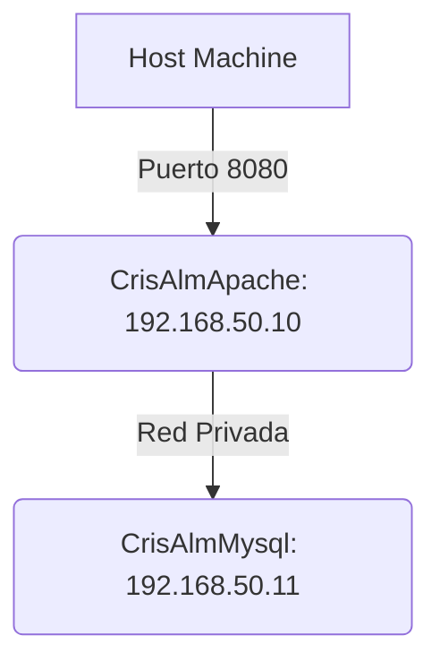

# Pila LAMP 2 Niveles: Aprovisionamiento con Vagrant
Infraestructura LAMP en dos máquinas virtuales (VMs), Apache y MySQL, aprovisionadas mediante scripts con Vagrant.

## Índice

* [1. Arquitectura](#1-arquitectura)
* [2. Requisitos Previos](#2-requisitos-previos)
* [3. Instrucciones de Despliegue](#3-instrucciones-de-despliegue)
* [4. Comprobación](#4-comprobación)

---

### 1\. ⚙️ Arquitectura.

| Máquina | Función | IP |
| --- | --- | --- |
| **CrisAlmApache** | Servidor Web (Apache + PHP) | `192.168.50.10` |
| **CrisAlmMysql** | Servidor de Base de Datos (MariaDB) | `192.168.50.11` |

Se crean dos máquinas virtuales, una para el servidor Web y otra para el servidor de base de datos. El servidor Web tendrá dos adaptadores de red

**Diagrama de Conexión:**



-----

### 2\. 🛡️ Aislamiento y Seguridad (CC1)

El servidor de base de datos (`CrisAlmMysql`) está protegido de conexiones externas, manteniendo el principio del menor privilegio:

  * **Aislamiento de Servicio (`bind-address`):** El script de MySQL modifica la configuración (`bind-address = 0.0.0.0`) para que el servicio escuche en la red privada.
  * **Restricción por Host (`GRANT`):** El usuario de la aplicación (`user`) está limitado por IP a conectarse **únicamente** desde el servidor Apache (`192.168.50.10`). Cualquier intento de conexión desde el Host o una máquina externa fallará.

-----

### 3\. 🛠️ Configuración Automatizada (CC4)

La coherencia de la aplicación se garantiza mediante la automatización:

  * **Configuración de `config.php`:** El script de Apache utiliza `sed` para reemplazar automáticamente los *placeholders* en el archivo `config.php` con las credenciales y la IP del servidor MySQL (`192.168.50.11`).
  * **Aprovisionamiento de la Base de Datos:** El script de MySQL crea la base de datos, el usuario, y realiza la importación del esquema de tablas desde `/vagrant/db/database.sql`.
  * **Despliegue Limpio:** El código se copia de `/vagrant/src` al directorio web, y se eliminan los archivos conflictivos (`index.html` por defecto de Apache).

-----

### 4\. 🚀 Instrucciones de Despliegue

Para desplegar la infraestructura, ejecute estos comandos desde la carpeta raíz del repositorio:

1.  **Aprovisionamiento Ordenado:** Es fundamental arrancar el servidor de la Base de Datos primero.
    ```bash
    # 1. Levantar y provisionar MySQL
    vagrant up mysql

    # 2. Levantar y provisionar Apache
    vagrant up apache
    ```
2.  **Acceso a la Aplicación:**
    Una vez finalizado el aprovisionamiento, la aplicación estará disponible en tu navegador en:
    `http://localhost:8080`

-----

¡Ya está\! Con ese `README.md`, el proyecto es indiscutible.

¿Necesitas que te ayude a revisar el guion para el *screencast* (video de prueba) o tienes alguna otra duda final?
