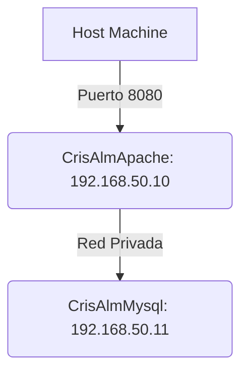

# Pila LAMP 2 Niveles: Aprovisionamiento con Vagrant
Infraestructura LAMP en dos máquinas virtuales (VMs), Apache y MySQL, aprovisionadas mediante scripts con Vagrant.

## Índice

* [1. Arquitectura y Conectividad](#1-arquitectura-y-conectividad)
* [2. Requisitos Previos e Instalación](#2-requisitos-previos-e-instalación)
* [3. Validación de Puntos de Control](#3-validación-de-puntos-de-control)
* [4. Script de Aprovisionamiento: Mysql](#4-script-de-aprovisionamiento-mysql)
* [5. Script de Aprovisionamiento: Apache](#5-script-de-aprovisionamiento-apache)

---

## 1\. ⚙️ Arquitectura.

La implementación de la infraestructura distribuida en dos máquinas virtuales separa el servidor web de la base de datos, creando una capa de aislamiento esencial para la seguridad.

| Máquina | Función | IP |
| --- | --- | --- |
| **CrisAlmApache** | Servidor Web (Apache + PHP) | `192.168.50.10` |
| **CrisAlmMysql** | Servidor de Base de Datos (MariaDB) | `192.168.50.11` |
 
El **servidor web** debe disponer de dos adaptadores de red: la **NAT**, que viene por defecto, y una **red interna** privada. Podrá comunicarse con el exterior y con la base de datos. El **servidor de base de datos** usará solo la **red interna**, garantizando que no tenga salida a internet. 



-----

## 2\. 🛡️ Aislamiento y Seguridad (CC1)

El servidor de base de datos (`CrisAlmMysql`) está protegido de conexiones externas, manteniendo el principio del menor privilegio:

  * **Aislamiento de Servicio (`bind-address`):** El script de MySQL modifica la configuración (`bind-address = 0.0.0.0`) para que el servicio escuche en la red privada.
  * **Restricción por Host (`GRANT`):** El usuario de la aplicación (`user`) está limitado por IP a conectarse **únicamente** desde el servidor Apache (`192.168.50.10`). Cualquier intento de conexión desde el Host o una máquina externa fallará.

-----

## 3\. 🛠️ Configuración Automatizada (CC4)

La coherencia de la aplicación se garantiza mediante la automatización:

  * **Configuración de `config.php`:** El script de Apache utiliza `sed` para reemplazar automáticamente los *placeholders* en el archivo `config.php` con las credenciales y la IP del servidor MySQL (`192.168.50.11`).
  * **Aprovisionamiento de la Base de Datos:** El script de MySQL crea la base de datos, el usuario, y realiza la importación del esquema de tablas desde `/vagrant/db/database.sql`.
  * **Despliegue Limpio:** El código se copia de `/vagrant/src` al directorio web, y se eliminan los archivos conflictivos (`index.html` por defecto de Apache).

-----

## 4\. 🚀 Instrucciones de Despliegue

Para desplegar la infraestructura, ejecute estos comandos desde la carpeta raíz del repositorio:

1.  **Aprovisionamiento Ordenado:** Es fundamental arrancar el servidor de la Base de Datos primero.
    ```bash
    # 1. Levantar y provisionar MySQL
    vagrant up mysql

    # 2. Levantar y provisionar Apache
    vagrant up apache
    ```
2.  **Acceso a la Aplicación:**
    Una vez finalizado el aprovisionamiento, la aplicación estará disponible en tu navegador en:
    `http://localhost:8080`

    
